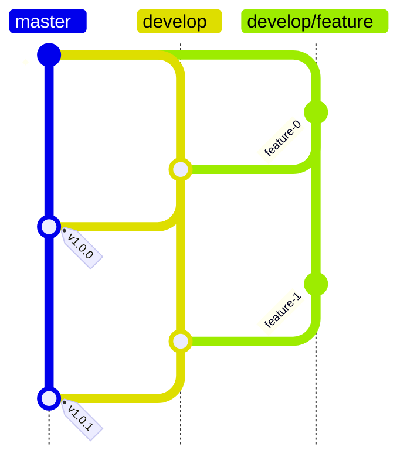
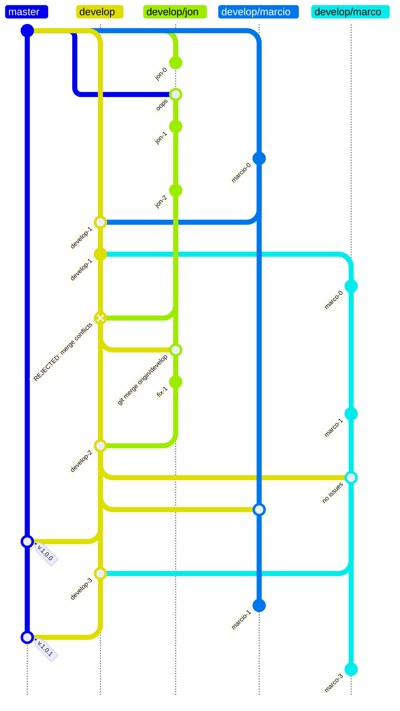

# PAOFLOW contribution model (proposed)

This project follows a **Gitflow-inspired** workflow with two long-lived branches:

- `master` is the **stable, released** branch intended for public consumption.
- `develop` is the **integration** branch where new features and bug fixes land.

The goal is simple: keep development work and released work separated so users can
rely on `master`, while developers can move quickly on `develop`.

## Branch roles (invariants)

**`master`**
- Contains only **release-quality** code.
- Moves forward only when `develop` is promoted and tagged.
- Branch protections will ensure merges to `master` come **only** from `develop`.

**`develop`**
- The shared branch for ongoing work.
- All feature branches merge back into `develop` (via PR).
- May be messy at times, but should not remain broken indefinitely.

## Develop branch and naming conventions

Contributors are expected to branch from `develop` and merge back into `develop`
using the naming convention:

- `develop/<feature_name>`

Branch protections will be enabled on `develop` so that PRs require 
at least one approval.

## Release cadence and promotion to `master`

On a periodic basis (according to our release cadence), the `develop` branch will
be run through a standardized test suite. Upon successful completion:

1. `develop` is merged into `master`
2. the merge commit on `master` receives a **release tag** (e.g., `v1.0.0`)
3. GitHub Release is created from that tag

This makes every public release on `master` reproducible by tag.

## Simplifications relative to Gitflow

This is based on the
[Gitflow workflow](https://www.atlassian.com/git/tutorials/comparing-workflows/gitflow-workflow).
However, PAOFLOW uses a simplified model:
- We do not maintain a separate long-lived `release` branch.
- Bug fixes follow the same path as features: `develop/<...>` → `develop` → `master`.

## A simple example

## The reality (merge conflicts, drift, and other forms of entropy)

Development is messy. Merge conflicts will still happen. The point of this model
is not to eliminate mess, but to contain it: develop absorbs change, while
master stays stable and release-tagged.

A common source of pain is long-lived feature branches drifting away from develop.
When that happens, the fix is to sync the feature branch with develop first
(resolve conflicts on the feature branch), then merge into develop.

## A more realistic example

