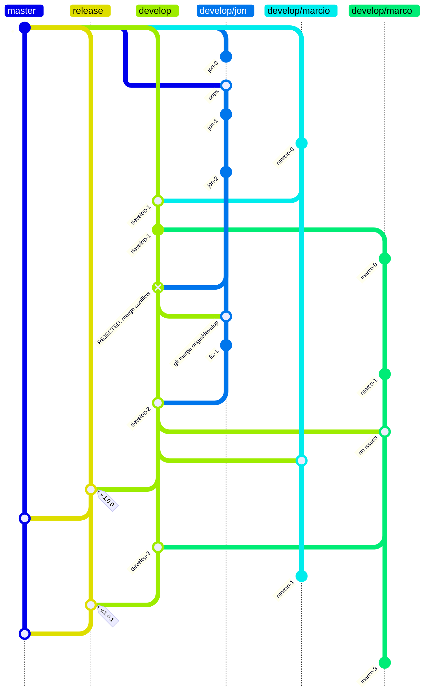

```mermaid
---
config:
  gitGraph:
    mainBranchName: 'master'
---
    gitGraph TB:
        commit id: ' ' 
        branch release
        branch develop
        branch develop/jon
        commit id: 'jon-0'
        commit id: 'jon-1'
        merge develop id: 'oops'
        commit id: 'jon-1'
        checkout develop
        branch develop/marcio
        commit id: 'marcio-0'
        checkout develop/jon
        commit id: 'jon-2'
        checkout develop
        merge develop/marcio id: "develop-1"
        checkout develop
        commit id: "develop-1 "
        branch develop/marco
        commit id: 'marco-0'
        checkout develop
        merge develop/jon id: "REJECTED: merge conflicts" type: REVERSE
        checkout develop/jon
        merge develop id: 'git merge origin/develop'
        commit id: 'fix-1'
        checkout develop/marco
        commit id: 'marco-1'
        checkout develop
        merge develop/jon id: "develop-2"
        checkout develop/marco
        merge develop id: 'no issues'
        checkout develop/marcio
        merge develop
        checkout release
        merge develop tag:'v.1.0.0'
        checkout master
        merge release
        checkout develop
        merge develop/marco id: "develop-3"
        checkout develop/marcio
        commit id: 'marcio-1'
        checkout release
        merge develop tag:'v.1.0.1'
        checkout master
        merge release 
        checkout develop/marco
        commit id: 'marco-3'
```
