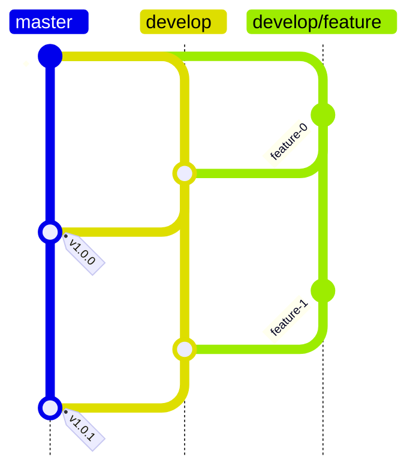
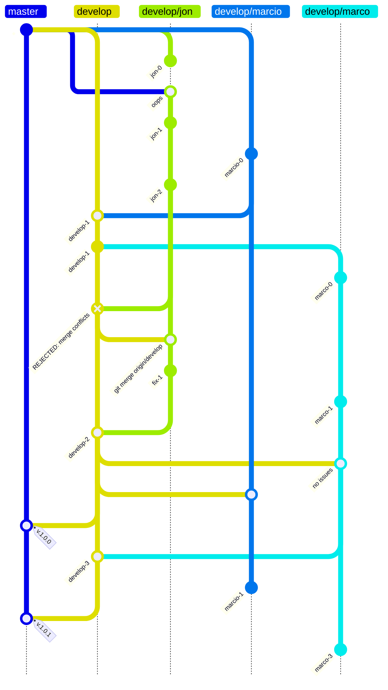

# PAOFLOW contribution model

This project follows a **Gitflow-inspired** workflow with two long-lived branches:

- `master` is the **stable, released** branch intended for public consumption.
- `develop` is the **integration** branch where new features and bug fixes land.

The goal is simple: keep development work and released work separated so users can
rely on `master`, while developers can move quickly on `develop`.

## Branch roles (invariants)

**`master`**

- Contains only **release-quality** code.
- Moves forward only when `develop` is promoted and tagged.
- Branch protections will ensure merges to `master` come **only** from `develop`.

**`develop`**

- The shared branch for ongoing work.
- All feature branches merge back into `develop` (via PR).
- May be messy at times, but should not remain broken indefinitely.

## Develop branch and naming conventions

Contributors are expected to branch from `develop` and merge back into `develop`
using the naming convention:

- `develop/<feature_name>`

Branch protections will be enabled on `develop` so that PRs require
at least one approval.

## Release cadence and promotion to `master`

On a periodic basis (according to our release cadence), the `develop` branch will
be run through a standardized test suite. Upon successful completion:

1. `develop` is merged into `master`
2. the merge commit on `master` receives a **release tag** (e.g., `v1.0.0`)
3. GitHub Release is created from that tag

This makes every public release on `master` reproducible by tag.

## Simplifications relative to Gitflow

This is based on the
[Gitflow workflow](https://www.atlassian.com/git/tutorials/comparing-workflows/gitflow-workflow).
However, PAOFLOW uses a simplified model:

- We do not maintain a separate long-lived `release` branch.
- Bug fixes follow the same path as features: `develop/<...>` → `develop` → `master`.

## A simple example


```mermaid
---
config:
  gitGraph:
    mainBranchName: 'master'
---
gitGraph TB:
    commit id: ' '
    checkout master
    branch develop
    checkout master
    branch develop/feature
    commit id: 'feature-0'
    checkout develop
    merge develop/feature
    checkout master
    merge develop tag: 'v1.0.0'
    checkout develop/feature
    commit id: 'feature-1'
    checkout develop
    merge develop/feature
    checkout master
    merge develop tag: 'v1.0.1'
```

## The reality (merge conflicts, drift, and other forms of entropy)

Development is messy. Merge conflicts will still happen. The point of this model
is not to eliminate mess, but to contain it: develop absorbs change, while
master stays stable and release-tagged.

A common source of pain is long-lived feature branches drifting away from develop.
When that happens, the fix is to sync the feature branch with develop first
(resolve conflicts on the feature branch), then merge into develop.

## A more realistic example


```mermaid
---
config:
  gitGraph:
    mainBranchName: 'master'
---
gitGraph TB:
    commit id: ' '
    branch develop
    branch develop/jon
    commit id: 'jon-0'
    commit id: 'jon-1'
    merge develop id: 'oops'
    commit id: 'jon-1'
    checkout develop
    branch develop/marcio
    commit id: 'marcio-0'
    checkout develop/jon
    commit id: 'jon-2'
    checkout develop
    merge develop/marcio id: "develop-1"
    checkout develop
    commit id: "develop-1 "
    branch develop/marco
    commit id: 'marco-0'
    checkout develop
    merge develop/jon id: "REJECTED: merge conflicts" type: REVERSE
    checkout develop/jon
    merge develop id: 'git merge origin/develop'
    commit id: 'fix-1'
    checkout develop/marco
    commit id: 'marco-1'
    checkout develop
    merge develop/jon id: "develop-2"
    checkout develop/marco
    merge develop id: 'no issues'
    checkout develop/marcio
    merge develop
    checkout master
    merge develop tag:'v.1.0.0'
    checkout develop
    merge develop/marco id: "develop-3"
    checkout develop/marcio
    commit id: 'marcio-1'
    checkout master
    merge develop tag:'v.1.0.1'
    checkout develop/marco
    commit id: 'marco-3'
```

# Developers' Guide

## 1. Writing readable and maintainable functions

- **Single Responsibility**: Each function should do one thing and do it well. If a function is trying to accomplish multiple tasks, consider breaking it into smaller functions.
- **Descriptive Names**: Use clear and descriptive names for functions and variables. This helps others understand the purpose of the code without needing to read through the implementation. Self-documenting code is easier to maintain and reduces the need for external documentation.
- **Documentation**: Use docstrings to explain the purpose of functions, their parameters, and return values. This is especially important for complex functions or those that may not be immediately clear to other developers.
- **Formatting**: Follow a consistent coding style throughout the codebase. This includes things like indentation, spacing, and naming conventions. Consistency makes it easier for developers to read and understand the code.
- **Testing**: Write tests for your functions to ensure they work as expected. This not only helps catch bugs early but also prevents regressions in future development.
- **Create examples**: If you create a new workflow in PAOFLOW, consider adding an example script with input files in the `examples` directory that demonstrates how to use it. This can serve as both documentation and a test case for the workflow.

### 1.1 Documentation Style

Any function or class should be documented using docstrings and properly type annotated. Here is an LLM prompt one can use to generate docstrings for a function or class:

#### **STYLE REQUIREMENTS (must follow)**

- Use **NumPy docstring format** with these **section headers exactly**: **Parameters**, **Returns**, **Notes** (and **Examples** only if explicitly requested).
- Keep tone **technical, concise, and neutral**.
- Use **full sentences** in descriptions.
- Use **type hints** in the docstring that match Python typing (e.g., `str`, `float`, `np.ndarray`, `Callable[[float, str], float]`, `Tuple[np.ndarray, np.ndarray]`, `Optional[np.ndarray]`). If a parameter is an instance of a project class (e.g. `DataController`), **type-hint it with the class**, not `dict`, `Any`, or `object`.
  Example: `data: DataController`
- Include **LaTeX math** under **Notes** using reST blocks with **exactly**:
  - `.. math::` on its own line
  - indented math lines
- In **Notes**, explain:
  - **what the function/class does**
  - **why it exists / where it is used**
  - key formulas and definitions as **bullet points** if helpful
  - Add **references** to papers, textbooks, or documentation if provided by the user.
  - If a function or method **adds to, modifies, or caches values in the
    `DataController` dictionary**, this must be documented.
    - Explicitly list **which keys are added or updated**,
- For arrays, describe **what they represent**, not just “an array”.
- Do **not** add implementation details that are not obvious from the code.
- Do **not** change code. Only produce docstrings.

### 1.2 Formatting Style

- In order to maintain a consistent code style, we use **Ruff** for linting and formatting. The pre-commit hooks will automatically apply formatting fixes and enforce linting rules on Python files before commits.
- The formatting rules can be customized in the `.pre-commit-config.yaml` file, but we will stick mostly to the defaults provided by Ruff, which are designed to be fast and non-controversial.
- Any code being merged to the `develop` branch will automatically run the pre-commit hooks in CI, so it's important to ensure that your code is properly formatted and linted before pushing. In order to do so without waiting for CI feedback, you can run the pre-commit hooks locally using the `pre-commit run` command. In order to do so, follow the instructions in the next subsection.

#### 1.2.1 Pre-commit Hooks

Install pre-commit (preferably inside your virtual or conda environment):

```bash
pip install pre-commit
```

OR using PAOFLOW's pyproject management tool, type the following from the PAOFLOW root directory:

```bash
pip install -e .[dev]
```

Verify installation:

```bash
pre-commit --version
```

Install the git hooks by running in PAOFLOW root:

```bash
pre-commit install
```

This ensures the checks run automatically on every `git commit`. Once you run the above steps for your one-time setup, you can run the hooks against all files to fix any existing issues:

```bash
pre-commit run --all-files
```

This will automatically apply any safe fixes (e.g. formatting) and show any remaining issues that need manual attention.

To clean up any broken hook environments (e.g. after rebasing or large refactors) and/or remove any cached hook environments, run:

```bash
pre-commit clean
pre-commit run --all-files
```

##### Optional: VSCode Integration

To automatically format your code while coding, in VSCode, you can install the "Ruff" extension and configure it to run on save. This way, every time you save a Python file, it will automatically apply the formatting rules defined in the pre-commit configuration. This further speeds up development by reducing the need to manually run pre-commit hooks or wait for CI feedback on formatting issues. After installing the Ruff extension, you can add the following settings to your VSCode `settings.json` to enable formatting on save:

```json
  "[python]": {
    "editor.wordBasedSuggestions": "off",
    "editor.rulers": [100],
    "editor.formatOnType": true,
    "editor.formatOnSave": true,
    "editor.defaultFormatter": "charliermarsh.ruff",
    "editor.codeActionsOnSave": {
      "source.fixAll.ruff": "explicit",
      "source.organizeImports.ruff": "explicit",
    },
  },
```

### 1.3 Testing Style

Tests are run using **pytest**. There are two main categories of tests:

1. **Unit tests**: Fast, isolated tests that verify individual functions or classes. These should run in milliseconds and do not require external resources.
2. **Integration tests**: Slower tests that verify the behavior of larger components or end-to-end functionality. These may require external resources (e.g. reference files) and can take time to run. There will be one folder per component in the examples directory. The integration tests can be run with input files derived from the examples, but run with lower accuracy settings (grid size, k-points, etc.) to speed up execution. The goal is to ensure the core logic of the examples is tested without requiring long runtimes or large files.

#### 1.3.1 Writing Unit Tests

All unit tests should be placed in appropriate subfolders in the `tests/unit` directory. When writing unit tests, keep the following guidelines in mind:

- **Test structure**: Each test function should be named starting with `test_` and should be placed in a file that also starts with `test_` (e.g. `test_module.py`). This allows pytest to automatically discover and run the tests.
- **Test content**: Each test should include assertions that verify the expected behavior of the code being tested. This can include checking return values, ensuring exceptions are raised when expected, and verifying that the state of the system is correct after the function is executed. For example, consider the following function that adds two numbers:

```python
def add(a: float, b: float) -> float:
    """Add two numbers together.
    Parameters
    ----------
    a : float
        The first number to add.
    b : float
        The second number to add.
    Returns
    -------
    float
        The sum of a and b.
    Notes
    -----
    This function takes two floating-point numbers as input and returns their sum. """
    return a + b
```

A corresponding unit test for this function might look like this:

```python
def test_add():
    assert add(1, 2) == 3
    assert add(-1, 1) == 0
    assert add(0, 0) == 0
    assert add(1.5, 2.5) == 4.0
```

This way, if someone modifies the `add` function in the future to something like `return a * b`, `test_add` will fail and alert the developer to the issue.

I don't recommend trying to write the unit tests yourself. Instead, provide an LLM with the function code and provide it with cases of how the function may be used incorrectly or in edge cases. The LLM can then generate a comprehensive set of test cases that cover both typical usage and edge cases, ensuring that the function is robust and behaves as expected in a variety of scenarios.

#### 1.3.2 Writing Integration Tests

If your work leads to the development of a dedicated example script in the `examples` directory, you should create a corresponding integration test in `tests/integration` that runs the example with low-accuracy (such as low-density energy grid) to verify the core logic without requiring long runtimes. Therefore, this directory will likely contain the `*.xml` files from Quantum Espresso, the pseudopotential files, and the PAOFLOW driver script, `main.py`. The directory should also include a "Reference" subfolder with reference output files that the test can compare against. Note that these reference files should be generated with the same low-accuracy settings used in the test to ensure they can be compared one-to-one.
