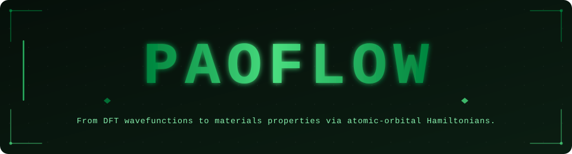

<p align="center">
  
</p>

<p align="center">
  <a href="https://paoflow.readthedocs.io"></a>
  <a href="https://github.com/marcobn/PAOFLOW/wiki"></a>
  <a href="https://github.com/marcobn/PAOFLOW/blob/master/License"></a>
  <a href="https://pypi.org/project/PAOFLOW/"></a>
</p>

---

## What is PAOFLOW?

PAOFLOW is an open-source Python framework for constructing and operating on **ab initio tight-binding Hamiltonians** built from the projection of DFT wavefunctions onto atomic orbital (PAO) bases. Starting from a converged DFT calculation (Quantum ESPRESSO or VASP), PAOFLOW delivers a compact, tight-binding-like Hamiltonian that serves as the engine for a broad range of materials-property calculations — without any empirical parameters.

---

## Capabilities

| Domain | What PAOFLOW computes |
|---|---|
| **Electronic structure** | Band structures, density of states (total & projected), Fermi surfaces |
| **Optical & dielectric response** | Complex dielectric tensor ε(ω), optical conductivity, joint density of states; non-local velocity correction for norm-conserving pseudopotentials |
| **Transport** | Electrical conductivity, Seebeck coefficient, electronic thermal conductivity (Boltzmann transport) |
| **Topology** | Berry curvature, anomalous Hall conductivity, Z₂ invariants, topological surface states |
| **Spin & magnetism** | Spin Hall conductivity, spin texture, non-collinear and fully-relativistic (SOC) Hamiltonians |
| **Model Hamiltonians** | Slater–Koster tight-binding models, Kane–Mele, custom lattice models |
| **ACBN0** | Self-consistent Hubbard U and U+V via the extended ACBN0 functional |
| **pyskeaf** | Fermi surface extremal orbit analysis (de Haas–van Alphen, Shubnikov–de Haas) |
| **Landauer transport** | Quantum transport via Green's function/Landauer–Büttiker formalism |
| **Interoperability** | Quantum ESPRESSO and VASP DFT code integration - other codes are in the development pipline (we welcome contributions from developers!)|

---

## Getting Started

```bash
pip install PAOFLOW
```

Full installation instructions (conda environment, MPI setup, optional dependencies) are in [INSTALL.md](INSTALL.md).

A step-by-step tutorial and worked examples are available in:
- 📖 **Documentation:** [paoflow.readthedocs.io](https://paoflow.readthedocs.io) *(full API reference, tutorials, theory notes)*
- 📚 **Wiki:** [github.com/marcobn/PAOFLOW/wiki](https://github.com/marcobn/PAOFLOW/wiki) *(how-to guides, FAQ, workflows)*
- 🗂️ **Examples:** [`examples/`](examples/) — QE, VASP, transport, TB models, ACBN0, and more

### Minimal workflow

```python
from PAOFLOW import PAOFLOW

pf = PAOFLOW.PAOFLOW(savedir='Si.save')
pf.projectability()
pf.pao_hamiltonian()
pf.bands(fname='bands')
pf.gradient_and_momenta()
pf.adaptive_smearing(smearing='gauss')
pf.dos(do_dos=True, do_pdos=False)
pf.finish()
```
PAOFLOW ships two small, dependency-light command-line generators that automate
the repetitive parts of setting up a study. They are installed with the package
as console commands:

1. **`paoflow-gen-qe`** — build a Quantum ESPRESSO `scf` input from an
   [AFLOW](https://aflow.org) database entry, with sensible defaults for
   smearing, magnetism, spin–orbit coupling, and the number of bands needed for
   PAOFLOW's extended-basis projections. Pseudopotentials from the Pseudo Dojo repository (https://www.pseudo-dojo.org/), are included in the distribution and should be used for the input generation.
2. **`paoflow-gen`** — interactively generate a PAOFLOW driver script
   (`main.py`) from the output of a Quantum ESPRESSO run, and optionally a
   companion **plotting script** (`plot.py`) that visualizes exactly the
   properties you selected.
---

## For Researchers

PAOFLOW has been used in high-throughput screening campaigns, topological materials discovery, optical/transport property databases, and quantum computing workflows, among others. It is an active platform for methodological development — recent additions include non-local velocity corrections for accurate optical spectra and Boltzmann transport beyond the constant relaxation-time approximation.

## For Industry & HPC

PAOFLOW is MPI-parallel, NumPy/SciPy-based, and designed to plug into existing DFT workflows with minimal overhead. The PAO Hamiltonian is orders of magnitude cheaper to diagonalize than the full DFT problem, enabling dense **k**-point sampling and fine spectral resolution at low computational cost.

---

## License & Citation

Copyright 2016–2026 — Marco Buongiorno Nardelli (mbn@unt.edu) and the PAOFLOW Development Team.

PAOFLOW is free software distributed under the **GNU General Public License v3**. See [License](License) for details.

If you use PAOFLOW in published work, please cite:

> F.T. Cerasoli, A.R. Supka, A. Jayaraj, I. Siloi, M. Costa, J. Slawinska, S. Curtarolo, M. Fornari, D. Ceresoli, and M. Buongiorno Nardelli,
> *Advanced modeling of materials with PAOFLOW 2.0: New features and software design*, Comp. Mat. Sci. **200**, 110828 (2021).

> M. Buongiorno Nardelli, F.T. Cerasoli, M. Costa, S. Curtarolo, R. De Gennaro, M. Fornari, L. Liyanage, A. Supka and H. Wang,
> *PAOFLOW: A utility to construct and operate on ab initio Hamiltonians from the Projections of electronic wavefunctions on Atomic Orbital bases, including characterization of topological materials*, Comp. Mat. Sci. **143**, 462 (2018).

> L.A. Agapito, A. Ferretti, A. Calzolari, S. Curtarolo and M. Buongiorno Nardelli,
> *Effective and accurate representation of extended Bloch states on finite Hilbert spaces*, Phys. Rev. B **88**, 165127 (2013).

> L.A. Agapito, S. Ismail-Beigi, S. Curtarolo, M. Fornari and M. Buongiorno Nardelli,
> *Accurate Tight-Binding Hamiltonian Matrices from Ab-Initio Calculations: Minimal Basis Sets*, Phys. Rev. B **93**, 035104 (2016).

> L.A. Agapito, M. Fornari, D. Ceresoli, A. Ferretti, S. Curtarolo and M. Buongiorno Nardelli,
> *Accurate Tight-Binding Hamiltonians for 2D and Layered Materials*, Phys. Rev. B **93**, 125137 (2016).

> P. D'Amico, L. Agapito, A. Catellani, A. Ruini, S. Curtarolo, M. Fornari, M. Buongiorno Nardelli and A. Calzolari,
> *Accurate ab initio tight-binding Hamiltonians: Effective tools for electronic transport and optical spectroscopy from first principles*, Phys. Rev. B **94**, 165166 (2016).
