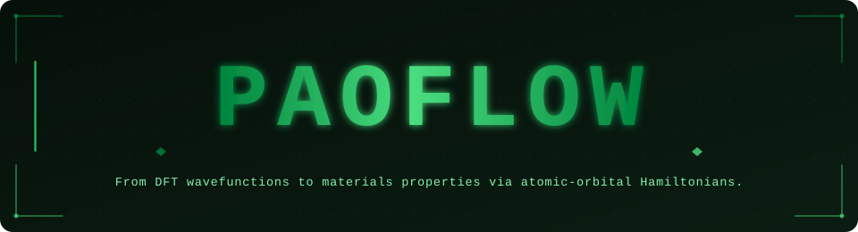

<p align="center">
  
</p>

<p align="center">
  <a href="https://paoflow.readthedocs.io"></a>
  <a href="https://github.com/marcobn/PAOFLOW/wiki"></a>
  <a href="https://github.com/marcobn/PAOFLOW/blob/master/License"></a>
  <a href="https://pypi.org/project/PAOFLOW/"></a>
</p>

---

## What is PAOFLOW?

PAOFLOW is an open-source Python framework for constructing and operating on **ab initio tight-binding Hamiltonians** built from the projection of DFT wavefunctions onto atomic orbital (PAO) bases. Starting from a converged DFT calculation (Quantum ESPRESSO or VASP), PAOFLOW delivers a compact, tight-binding-like Hamiltonian that serves as the engine for a broad range of materials-property calculations — without any empirical parameters.

---

## Capabilities

| Domain | What PAOFLOW computes |
|---|---|
| **PAO basis and projections** | Projections of the Kohn–Sham states on atomic orbitals computed internally (no `projwfc.x`), basis presets (`minimal`, `standard`, `extended`), basis tables generated from the pseudopotentials (`paoflow-genbasis-ps`); ultrasoft and PAW pseudopotentials projected in the augmented metric (scalar-relativistic and spin-orbit), with the valence shells taken from the UPF pseudo-orbitals |
| **Electronic structure** | Band structures, density of states (total & projected), Fermi surfaces, effective masses, band unfolding of supercells to the primitive cell; Wigner–Seitz interpolation (cell- or bond-resolved, the latter keeping the full space group) next to zero padding, at the same cost; a sparse bond-list backend for large doubled cells |
| **Self-consistent Hubbard correction** | The ACBN0 and eACBN0 pseudohybrid density functionals for the U and V parameters of DFT+U and DFT+U+V |
| **Spin & magnetism** | Spin texture, non-collinear and fully-relativistic (SOC) Hamiltonians, ad-hoc spin–orbit coupling; magnetic fields on site (Zeeman, μ_B(**L** + g_s**S**)·**B**) and on the hoppings (Peierls phases: Landau levels, Hofstadter spectra, edge states); orbital moments and the orbital magnetization (modern theory); Stoner parameters, the self-consistent spin response and the static spin susceptibility (bare, on-site Stoner, full-grid LSDA kernel) |
| **Optical & dielectric response** | Complex dielectric tensor ε(ω) (also at a finite electronic temperature), optical conductivity, joint density of states; Kubo–Greenwood optical response of any observable; local fields and exchange–correlation kernels (ALDA, long-range and bootstrap kernels) in the coupled response of crystals; Löwdin position dipoles of the PAO basis in the velocity operator (beyond the tight-binding position operator, with the PAW augmentation); Drude and extended-Drude response and thermal emissivity of metals |
| **Non-linear optics** | Shift current (bulk photovoltaic effect), injection currents and second-harmonic generation from the PAO Hamiltonian on dense k-grids: U(N)-covariant treatment of degenerate bands, position dipoles in r and its generalized derivative, point-group reduction of the k-grid, 2D sheet units; molecules (Γ-only cells, hyperpolarizabilities, coupled local-field response); metals (density-matrix equations of motion with the Fermi-surface and Drude terms); model Hamiltonians |
| **Transport** | Electrical conductivity, Seebeck coefficient, electronic thermal conductivity, Hall and Nernst tensors (Boltzmann transport); chemical potential versus temperature and doping, and the transport of a doped semiconductor along its temperature curve; scattering channels (built-in energy- and temperature-dependent relaxation-time models and electron–phonon rates) combined by Matthiessen's rule |
| **Kubo-formula response** | One Kubo–Bastin orchestrator for the charge, spin and orbital currents and the spin and orbital densities (Fermi-surface and Fermi-sea terms, intra- and interband parts, constant broadening): anomalous, spin and orbital Hall conductivities, Rashba–Edelstein tensors, longitudinal conductivity |
| **Lattice dynamics & phonons** | Phonon dispersions, DOS and thermal properties ([phonopy](https://phonopy.github.io/phonopy/) finite-displacement); Born effective charges, ε∞ and LO–TO splitting; infrared (IR), non-resonant (Placzek) and resonant (Albrecht) Raman spectra; vibrational (ionic) dielectric ε(ω) and reststrahlen emissivity; quasi-harmonic approximation (thermal expansion, V(T), bulk modulus, C_p, thermodynamic and mode Grüneisen dispersion); anharmonic free energies and renormalized phonons with the stochastic self-consistent harmonic approximation ([python-sscha](https://sscha.eu)); special displacements (Zacharias–Giustino) for thermal averages |
| **Electron–phonon coupling** | Coarse vertex built natively from the `ph.x` DFPT potentials and the nscf wavefunctions (EPW `.epb` files also accepted), interpolated to dense k and q grids in the PAO basis with the long-range Fröhlich and quadrupole fields; Eliashberg function, λ and T_c (Allen–Dynes, isotropic Migdal–Eliashberg with Padé continuation, anisotropic Migdal–Eliashberg for multi-gap superconductors); phonon-assisted optical absorption and thermal emissivity; carrier mobility of semiconductors (SERTA/MRTA) and resistivity of metals (transport Eliashberg function); Fan–Migdal self-energies and phonon linewidths; adaptive smearing of the deltas; a finite-difference vertex from displaced supercells (fixed basis) and temperature-dependent band structures and optics from special-displacement supercells; node-parallel DFPT vertex |
| **ARPES** | Photoemission intensity of the PAO states (dipole matrix elements with a plane-wave final state, chinook formalism), spectral functions with band- and k-resolved electron–phonon self-energies, band maps and kinks |
| **Topology** | Berry curvature and Berry phase, Z₂ invariants (pfaffian, and Wannier charge centres through Z2Pack), mirror Chern numbers, Weyl-point search, topological surface states |
| **Model Hamiltonians** | A library of lattice models run through the same code as a first-principles Hamiltonian: single-band, Rice–Mele, graphene/Haldane, Kane–Mele, transition-metal dichalcogenides, Weyl, parabolic and two- to four-band prototypes, the PythTB models, and electron–phonon model crystals; Slater–Koster parameterization (with band weights) with environmental dependence (EDTB) and structural transferability |
| **Quantum oscillation analysis** | de Haas–van Alphen and Shubnikov–de Haas frequencies and effective masses via the extremal-orbit finder `pyskeaf`, with `fermi-plotter` to display Fermi surfaces and field directions |
| **Landauer–Büttiker quantum transport** | Transmission functions, conductance, eigenchannels and current–voltage characteristics for nanoscale conductor/lead geometries and for bulk crystals (3D, resolved in the transverse momentum); non-equilibrium Green's functions at finite bias, self-consistent with a planar or a 3D electrostatic potential (junctions, wires, molecules) |
| **Comparison with experiment** | Agentic workflows ([`agentic/`](agentic/)) that compare quantum oscillations, temperature-dependent optics, electron–phonon transport, superconductivity, ARPES, non-linear optics and SSCHA phonons with experimental data given as tables, text or figures; campaign orchestration over several machines (planning, preflight checks, a background watcher) |
| **PAOFLOW Studio** | A browser interface (`paoflow-studio`) that asks the questions of every generator workflow, runs Quantum ESPRESSO and PAOFLOW locally or on a remote machine, and browses and plots the results (a catalogue of the output files, an output manifest with the commit of the code, a crystal viewer, production figures, a gallery of the example cases) |
| **Interoperability** | Quantum ESPRESSO and VASP DFT code integration (the augmented-metric projections and the electron–phonon pipeline read Quantum ESPRESSO outputs; VASP runs use the all-electron basis route); physical constants of CODATA 2018, as in Quantum ESPRESSO 7. Other codes are in the development pipeline — we welcome contributions from developers! |

---

## What's new in PAOFLOW 4.0

- **PAOFLOW Studio.** `paoflow-studio` opens a browser interface on the generators: Setup (the questions of each workflow, the example cases), Runs (Quantum ESPRESSO and PAOFLOW, locally or on a remote machine, with the parallel layout checked before launch), Results (every output file recognized by a catalogue, plotted, exported, gathered in a report) and Plots (the generated plot scripts, for production figures). Every run writes `paoflow_outputs.json` with the version, the commit of the code and the facts the file names do not carry. See the [Studio guide](docs/tutorials/howtos/browser-gui.md).
- **Magnetic fields.** `magnetic_field()` (Zeeman coupling of spin and orbital moments), `peierls_field()` (Landau levels, Hofstadter spectra, edge states in ribbons), `orbital_moment()` and `orbital_magnetization()`, and `spinor_basis()`. See [docs/internals/magnetic-fields.md](docs/internals/magnetic-fields.md).
- **Spin response.** `stoner_parameters()`, `self_consistent_spin()` and `spin_susceptibility()`: the Stoner-enhanced static susceptibility of paramagnets and the moments of ferromagnets from the LSDA kernel, on site or on the full real-space grid (the grid route within 3–9 % of fixed-spin-moment DFT for Pd, Pt and Fe). See [docs/internals/spin-response.md](docs/internals/spin-response.md).
- **Kubo response.** `kubo_response()` (Kubo–Bastin: charge, spin and orbital currents, spin and orbital densities, every term separately) and `kubo_optical_response()` (Kubo–Greenwood at finite frequency). See [docs/internals/kubo-bastin.md](docs/internals/kubo-bastin.md).
- **Non-linear and coupled optical response** of molecules (hyperpolarizabilities with local fields), of crystals (`coupled_optical_response()`: local fields, ALDA and long-range kernels) and of metals (a density-matrix engine with the Fermi-surface terms). See [docs/internals/nonlinear-optics.md](docs/internals/nonlinear-optics.md).
- **Quantum transport at finite bias.** `Transport.compute_current_self_consistent()`: non-equilibrium Green's functions with a self-consistent planar or 3D electrostatic potential; Landauer transmission of bulk crystals in 3D. See [docs/internals/negf-finite-bias.md](docs/internals/negf-finite-bias.md) and [docs/internals/negf-3d-electrostatics.md](docs/internals/negf-3d-electrostatics.md).
- **Anharmonic lattice dynamics and thermal averages.** The SSCHA interface (`sscha_setup()`, `sscha_minimize()`, …), the special displacement method (`special_displacement()`) and a finite-difference electron–phonon vertex. See [docs/internals/sscha.md](docs/internals/sscha.md), [docs/internals/special-displacement.md](docs/internals/special-displacement.md) and [docs/internals/finite-difference-vertex.md](docs/internals/finite-difference-vertex.md).
- **More methods:** `z2_invariant()` (Wannier charge centres), `doped_transport()`, Wigner–Seitz interpolation in `bands()` and `interpolated_hamiltonian()`, a dielectric function at finite electronic temperature, the model-Hamiltonian library and the electron–phonon model crystals (`paoflow-gen ep_model`), and agentic campaign management ([docs/internals/agentic-campaign.md](docs/internals/agentic-campaign.md)).
- **Examples and tests.** Every worked calculation is a case in [`examples/cases/`](examples/cases/) (`paoflow-gen --example list`, or the Examples gallery of the Studio); scripts outside the generators are in [`examples/recipes/`](examples/recipes/). Unit tests read only `tests/data` and `PSEUDOS/library` and run in CI.
- **Corrections that change numbers.** The physical constants are those of CODATA 2018 (shifts of a few parts in 10⁵); the momentum matrix uses one basis of every degenerate subspace for the three Cartesian directions (off-diagonal tensors at degenerate **k** points, Hall coefficients); the spinor basis of the internal projections with spin–orbit coupling; the Fourier convention of the model Hamiltonians (`H(R)` stored at −**R**, as for the projected ones); the band rotation of the electron–phonon vertex. Details in the developer notes of [`docs/internals/`](docs/internals/).

## New in PAOFLOW 3.0

- **Electron–phonon coupling without EPW.** The coarse vertex is built from the `ph.x` `dvscf` files and the nscf wavefunctions and interpolated in the PAO basis; superconductivity (isotropic and anisotropic Migdal–Eliashberg), phonon-assisted absorption and emissivity, carrier mobility, metal resistivity and ARPES self-energies follow from it. One system folder per crystal in [`examples/elphon/`](examples/elphon/), written by `paoflow-gen elphon`. See [docs/internals/Electron-Phonon-Coupling.md](docs/internals/Electron-Phonon-Coupling.md).
- **Non-linear optics.** `PAOFLOW.nonlinear_optics()` computes shift and injection currents and the second-harmonic susceptibility; examples and a validation report in [`examples/nlo_examples/`](examples/nlo_examples/). See [docs/internals/nonlinear-optics.md](docs/internals/nonlinear-optics.md).
- **ARPES simulation.** `PAOFLOW.arpes` with the photoemission matrix elements of the PAO states and electron–phonon self-energies. See [docs/internals/arpes.md](docs/internals/arpes.md).
- **Position dipoles in the velocity operator.** The Löwdin dipoles of the PAO basis complete the tight-binding velocity for optics, Hall conductivities and non-linear optics; the former non-local velocity term is superseded. See [docs/internals/position-dipoles.md](docs/internals/position-dipoles.md).
- **Projections for ultrasoft and PAW pseudopotentials** in the augmented metric, also with spin-orbit coupling (the spinor charges of the fully relativistic pseudopotentials), with the valence shells from the UPF pseudo-orbitals, and a basis generator from the pseudopotentials. See [docs/internals/internal-basis.md](docs/internals/internal-basis.md).
- **Scattering channels** shared by Boltzmann transport and the intraband optics of metals. See [docs/internals/scattering-channels.md](docs/internals/scattering-channels.md).
- **Agentic workflows** for the comparison with experiment, and the `paoflow-gen` generators for every workflow. See [`agentic/README.md`](agentic/README.md) and [docs/internals/cli-generators.md](docs/internals/cli-generators.md).
- **Sparse backend**, band unfolding, Slater–Koster/EDTB fitting, `pyskeaf` and the quantum-oscillation analysis, and the optional Rust kernels.

---

## Getting Started

```bash
pip install PAOFLOW                 # or "PAOFLOW[gui]" for the plots of PAOFLOW Studio
```

Full installation instructions (conda environment, MPI setup, optional extras, command-line tools, the Rust backend) are in the [installation guide](docs/installation.md), also published at [paoflow.readthedocs.io](https://paoflow.readthedocs.io).

A step-by-step tutorial and worked examples are available in:
- 📖 **Documentation:** [paoflow.readthedocs.io](https://paoflow.readthedocs.io) *(quickstart, tutorials, theory notes, developer internals, full API reference)*
- 📚 **Wiki:** [github.com/marcobn/PAOFLOW/wiki](https://github.com/marcobn/PAOFLOW/wiki) *(how-to guides, FAQ, workflows)*
- 🗂️ **Examples:** [`examples/cases/`](examples/cases/) — 24 worked calculations (bands and transport, optics, ACBN0, spin–orbit, topology, Hall effects, magnetism, Landauer transport), each set up by `paoflow-gen --example <name>`; [`examples/recipes/`](examples/recipes/) (VASP, basis presets, sparse backend, low-level Landauer); electron–phonon system folders, non-linear optics, tight-binding models, band unfolding and quantum oscillations in [`examples/`](examples/)

### Minimal workflow

```python
from PAOFLOW import PAOFLOW

pf = PAOFLOW.PAOFLOW(savedir='silicon.save', smearing='gauss')
pf.read_atomic_proj_QE()       # or pf.projections() for the internal projections
pf.projectability()
pf.pao_hamiltonian()
pf.bands(ibrav=2, nk=200)
pf.interpolated_hamiltonian()
pf.pao_eigh()
pf.gradient_and_momenta()
pf.adaptive_smearing()
pf.dos(emin=-12.0, emax=2.2)
pf.transport(emin=-12.0, emax=2.2)
pf.finish_execution()
```

Scripts run in parallel with MPI: `mpirun -np 8 python main.py`. The same workflow, set up and run from the browser:

```bash
paoflow-gen --example si_bands_transport    # copy a case and write its drivers
paoflow-studio                              # or open PAOFLOW Studio
```

### Command-line tools

PAOFLOW installs six console commands:

| Command | Purpose |
|---|---|
| `paoflow-gen-qe` | Builds a Quantum ESPRESSO `scf` input from an online materials-database entry, with sensible defaults for smearing, magnetism, spin–orbit coupling and the number of bands needed for the extended-basis projections. [AFLOW](https://aflow.org) serves bulk crystals and [C2DB](https://cmr.fysik.dtu.dk/c2db/c2db.html) two-dimensional materials (vacuum padding, in-plane **k**-grid, `assume_isolated='2D'`); the source is auto-detected from the identifier or set with `--source`. Pseudopotentials from [Pseudo Dojo](https://www.pseudo-dojo.org/) ship with the distribution. |
| `paoflow-gen` | Interactively generates driver scripts from the output of a Quantum ESPRESSO run. Workflows: **run** (a property driver `main.py` for bands, DOS/PDOS, transport, optical, non-linear optical, Kubo, topology, magnetic and spin response, … with a 2D-aware band path, plus a matching `plot.py`), **acbn0** (self-consistent Hubbard U / U+V with the comparison plot of the converged band structures), **tb_model** (a model Hamiltonian, no first-principles run), **landauer** (transmission, eigenchannels and finite bias), **phonon** (the three-phase lattice-dynamics driver, optionally with the Raman workflow), **sscha**, **elphon** (a complete electron–phonon *system folder*: `system.py`, the QE phonon and nscf inputs, and the thin drivers for phonons, coupling, superconductivity, optics, transport and ARPES, in the layout of `examples/elphon/`), **ep_model** (electron–phonon model crystals) and **pyskeaf**. `--example NAME` starts from a case of `examples/cases/`; `--gui` asks the same questions in the browser. |
| `paoflow-studio` | PAOFLOW Studio, the browser interface: setup, runs (local or remote) and results; `paoflow-studio plot <folder>` opens the results of a run. |
| `paoflow-genbasis-ps` | Generates the atomic-orbital basis tables from the pseudopotentials of a calculation (all-electron and pseudo-atom radial functions, ghost-state filtering for ultrasoft/PAW). |
| `pyskeaf` | Extremal Fermi-surface orbits from the PAOFLOW Fermi surface: de Haas–van Alphen frequencies, effective masses and curvatures. |
| `fermi-plotter` | Displays Fermi surfaces and the magnetic-field directions of the quantum-oscillation analysis. |

---

## For Researchers

PAOFLOW has been used in high-throughput screening campaigns, topological materials discovery, optical/transport property databases, and quantum computing workflows, among others. It is an active platform for methodological development — recent additions include magnetic fields and the self-consistent spin response, the Kubo–Bastin response functions, non-equilibrium transport at finite bias, the SSCHA and special-displacement routes to anharmonic and thermal effects, the electron–phonon pipeline built on the DFPT potentials, the second-order optical responses of crystals, molecules and metals, the ARPES simulation, and the position dipoles that complete the velocity operator of the PAO basis. The agentic workflows in [`agentic/`](agentic/) turn these into reproducible comparisons with experimental data.

## For Industry & HPC

PAOFLOW is MPI-parallel, NumPy/SciPy-based, and designed to plug into existing DFT workflows with minimal overhead. The PAO Hamiltonian is orders of magnitude cheaper to diagonalize than the full DFT problem, enabling dense **k**-point sampling and fine spectral resolution at low computational cost. Hybrid MPI + joblib parallelism stays within the core budget of each rank.

An **optional Rust backend** ([`rust/`](rust/)) further accelerates the heaviest numerical kernels — the ACBN0/eACBN0 four-centre Coulomb integrals (ERIs), the dielectric/JDOS response loops and the phonon-assisted absorption kernel. It is fully optional and imported opportunistically: when the compiled `paoflow_rs` module is unavailable, PAOFLOW falls back to its pure-Python/NumPy implementation with numerically identical results (parity < 1e-12). See the [Rust backend guide](rust/README.md) for build and usage instructions.

---

## License & Citation

Copyright 2016–2026 — Marco Buongiorno Nardelli (mbn@unt.edu) and the PAOFLOW Development Team.

PAOFLOW is free software distributed under the **GNU General Public License v3**. See [License](License) for details.

If you use PAOFLOW in published work, please cite:

> F.T. Cerasoli, A.R. Supka, A. Jayaraj, I. Siloi, M. Costa, J. Slawinska, S. Curtarolo, M. Fornari, D. Ceresoli, and M. Buongiorno Nardelli,
> *Advanced modeling of materials with PAOFLOW 2.0: New features and software design*, Comp. Mat. Sci. **200**, 110828 (2021).

> M. Buongiorno Nardelli, F.T. Cerasoli, M. Costa, S. Curtarolo, R. De Gennaro, M. Fornari, L. Liyanage, A. Supka and H. Wang,
> *PAOFLOW: A utility to construct and operate on ab initio Hamiltonians from the Projections of electronic wavefunctions on Atomic Orbital bases, including characterization of topological materials*, Comp. Mat. Sci. **143**, 462 (2018).

> L.A. Agapito, A. Ferretti, A. Calzolari, S. Curtarolo and M. Buongiorno Nardelli,
> *Effective and accurate representation of extended Bloch states on finite Hilbert spaces*, Phys. Rev. B **88**, 165127 (2013).

> L.A. Agapito, S. Ismail-Beigi, S. Curtarolo, M. Fornari and M. Buongiorno Nardelli,
> *Accurate Tight-Binding Hamiltonian Matrices from Ab-Initio Calculations: Minimal Basis Sets*, Phys. Rev. B **93**, 035104 (2016).

> L.A. Agapito, M. Fornari, D. Ceresoli, A. Ferretti, S. Curtarolo and M. Buongiorno Nardelli,
> *Accurate Tight-Binding Hamiltonians for 2D and Layered Materials*, Phys. Rev. B **93**, 125137 (2016).

> P. D'Amico, L. Agapito, A. Catellani, A. Ruini, S. Curtarolo, M. Fornari, M. Buongiorno Nardelli and A. Calzolari,
> *Accurate ab initio tight-binding Hamiltonians: Effective tools for electronic transport and optical spectroscopy from first principles*, Phys. Rev. B **94**, 165166 (2016).
